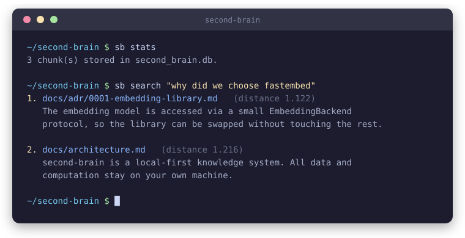

<div align="center">

# 🧠 second-brain

### Your notes, searchable by meaning, entirely on your own machine.

[](https://github.com/neiakgna/second-brain/actions/workflows/ci.yml) &nbsp;  &nbsp; 

<br>



<br><br>

**Built with** &nbsp;     

</div>

---

## ✨ What it does

second-brain turns a folder of markdown notes into a knowledge base you can search by *meaning*. Ask **"how do I boil pasta"** and it surfaces your cooking note, even if those exact words never appear in it.

No cloud. No accounts. No data leaves your machine.

## 💡 Why

I wanted to search my own writing the way I search the web: by intent, not keywords. Existing tools either lean on cloud APIs (a privacy problem for personal notes) or only do keyword matching. second-brain does neither. It is fully offline *and* semantic.

## 🚀 Quickstart

Requires Python 3.11+ and [uv](https://docs.astral.sh/uv/).

```bash
git clone https://github.com/neiakgna/second-brain.git
cd second-brain
uv sync
```

Index a folder of notes, then ask it anything:

```bash
uv run sb ingest ~/notes        # chunk, embed, and store every .md file
uv run sb search "your question here"
uv run sb stats                 # how many chunks are indexed
```

> The first `ingest` downloads the embedding model (~90 MB) once. Everything after that runs offline.

## ⚙️ How it works

A four-stage pipeline turns raw markdown into searchable meaning:

```
  ┌──────────┐    ┌──────────┐    ┌──────────┐    ┌──────────┐
  │  ingest  │──► │  embed   │──► │  store   │──► │  search  │
  └──────────┘    └──────────┘    └──────────┘    └──────────┘
```

| Stage | Module | What happens |
|-------|--------|--------------|
| **Ingest** | `ingest.py` | Walk a directory, split markdown into paragraph-aware chunks |
| **Embed** | `embed.py` | Turn each chunk into a 384-dim vector with a local `all-MiniLM-L6-v2` model |
| **Store** | `store.py` | Persist chunks and vectors in SQLite via the `sqlite-vec` extension |
| **Search** | `search.py` | Embed the query, return the nearest stored vectors |

The model sits behind a small `EmbeddingBackend` protocol, so the underlying library can be swapped without touching anything else. See [`docs/architecture.md`](docs/architecture.md) and the [architecture decision records](docs/adr/), including [why fastembed over sentence-transformers](docs/adr/0001-embedding-library.md).

## 📁 Project structure

```
src/second_brain/
  cli.py        # the `sb` command-line interface
  ingest.py     # markdown walking + chunking
  embed.py      # text to vector embedding
  store.py      # sqlite-vec persistence + vector search
  search.py     # query orchestration
tests/          # test suite, runs in under a second with no model download
docs/           # architecture notes and ADRs
```

## 🧪 Development

```bash
uv run pytest            # run the test suite
uv run ruff check .      # lint
uv run mypy src/         # strict type checking
```

The tests use fake embedding backends, so they run instantly with no model download. To exercise the real model:

```bash
SB_RUN_SLOW_TESTS=1 uv run pytest
```

## 🗺️ Roadmap

- [x] **v0.1** : CLI: ingest markdown, embed locally, semantic search
- [ ] **v0.2** : Hybrid retrieval (vector + keyword)
- [ ] **v0.3** : Local LLM synthesis, answering questions instead of just finding chunks
- [ ] **v0.4** : Web UI
- [ ] **v0.5** : More sources, including RSS feeds and browser bookmarks
- [ ] **v1.0** : Docker Compose deployment, encrypted sync

## 📄 License

Released under the [MIT License](LICENSE).

---

<div align="center">

**Built by H**

<sub>Local-first by design.</sub>

</div>
